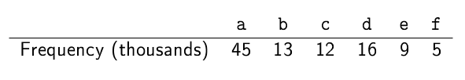
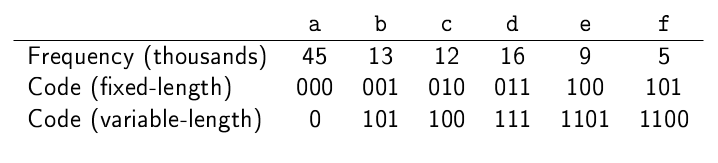

# Huffman coding

In this assignment you will implement the *Huffman coding*. This is a
very elegant and simple but powerful compression algorithm. The idea
is to generate a binary sequence that represents each character
required. This might be the English alphabet, some subset of that, or
any collection of symbols.

Say we have a 100KB file made up of repetitions of the letters 'a' to 'f'.
We start by creating a frequency table:



If we use a fixed-length code we can encode this data in about
37.5KB. If we use a variable-length code and assign the shortest code
to the most frequently used characters, we can encode it in just
28KB. (Note that in the table below the code for each character is
made up of the *bits* 1 and 0, not made the *characters*, each of
which occupies at least 8 bits depending on the encoding.)



It should be clear that in order to decode a stream of variable-length
codes, no code should be a prefix of any other.  We can create the
variable-length codes using a binary tree (not a search tree) called a
*Huffman tree*. In a Huffman tree the leaves contain the data, which
is a character and its frequency. Internal nodes are labelled with the
combined frequencies of their children.


To decode data we go start at the root and go left for 0, and right
for 1 until we get to a leaf. So, to decode `0101100`, we start at the
root and after consuming a single digit from the code, `0`, we reach a
leaf labelled `a`. We return to the root and take digits from the code
until we reach another leaf, which is labelled `b`, and so on,
eventually decoding the whole string `abc`.

The most elegant part of this scheme is the algorithm used to create the tree:

1. Use the frequency table to make a leaf node object for each character, including a label
for its frequency.
2. Put these nodes in a *priority queue*, where the lowest
frequency has highest priority.
3. Repeatedly:
    - Remove two nodes from the queue and insert them as children
to a new branch node. The new node is labelled by the sum of the frequency labels of its children.
    - Put the new node back in the queue.
    - When there is only one item in the queue, that's the Huffman
tree.

## Problems

Before starting the work you should read and understand the code provided. Pay
attention to the code in the package `huffman.tree`. This code represents a binary 
Huffman tree made up of *branch* nodes and *leaf* nodes. Because it is a Huffman tree,
each branch node is labelled with an `int`, whereas leaf nodes have two labels, an 
`int` and a `char`. The `Node` class is an abstract class which is the *superclass* 
of the classes `Branch` and `Leaf`. `Node` contains the implementation of several 
methods that are common to any subclass (`getFreq`, `setFreq` and `toString`) and 
one that will be implemented differently in branches and leaves: `traverse`.

1. First, implement the *priority queue* in the class
`PQueue`. (**NB:** you need to implement the priority queue
*yourself*. You will not be given any credit for importing and using a
class such as `java.util.PriorityQueue`.) The queue stores *node* objects, which are 
instances of the class `huffman.tree.Node`, a simple class which represents a 
node in an `int`-labelled tree and which is written for you. The nodes 
in the queue are stored in an `ArrayList`. The `enqueue` method adds a node to the
queue. The new node should be inserted at the point where the
label of the next node is *greater than or equal to* the label of the new
node. So work out where that is, then use the `add` method of the
`ArrayList` class, which takes a position at which to add the new
object. The `dequeue` method simply removes the first node from the
queue, for which you can use the `get` method of `ArrayList`. The
`size` method should return the size of the queue.
 
2. Implement the `freqTable` method in `Huffman`. If the input to
 this method is `null`, return `null` straight away.  Otherwise,
 create a new `map` like so:
 
   ```
   Map<Character, Integer> ft = new HashMap<>();
   ``` 
    
   This is a map from characters to integers, representing the frequency of each character in the input string. 
   Loop through the input string. For each character, if it is already in the map update its entry in the map by 
   adding one to it. If this character is not in the map, add a new entry for it with the count set to 1. Some 
   methods from `Map` you will find useful are `containsKey`, `get` and `put`.
    
   At this point, you should be able to make one of the tests pass.
    
3. Implement the `treeFromFreqTable` method, which constructs a Huffman tree from a frequency table. First, create an 
 empty priority queue. Then make a leaf node for every entry in the frequency table and add it to the queue. Next, take 
 the first two nodes from the queue and combine them in a branch node that is labelled by the combined frequency of the 
 nodes and put it back in the queue. The right child of the new branch node should be the node with the larger frequency
 of the two (presuming one of the labels is larger than the other -- if not, it doesn't matter which is which). Do this 
 repeatedly until there is a single node in the queue, which is the Huffman tree.
 
4. Implement the `traverse` method in the `Branch` and `Leaf` classes. This method creates a map of characters and 
 their Huffman codes from a Huffman tree. In the `Branch` class this method should call itself recursively on the left and 
 right children of the branch. Each of these calls returns a map, and you should return the result of *merging* the two
into a single map. There are several ways of doing this, the simplest of which is probably the [`putAll`](https://docs.oracle.com/javase/8/docs/api/java/util/HashMap.html#putAll-java.util.Map-) method of `Map`. 

   The recursive calls to `traverse` each take a new (different) list. You need to add `false` to the list passed to the 
method call on the left-hand child, and `true` to the list passed to the right. These lists of booleans represent the 
path being taken. It is essential that the lists passed to the recursive calls are *deep copies* of the original list, 
not references (aliases) to the same list -- otherwise changes to either list will show up in all copies. The easiest 
way to make a deep copy is by using the constructor of `ArrayList` that takes a list as an argument. For example:
 
   ```
   // make a deep copy of the list and add false to it
   ArrayList<Boolean> leftList = new ArrayList(list);
   leftList.add(false);
   ```
 
    In the `Leaf` class the method should create a new map, store the pair of the character (the label of the leaf) 
and the list of booleans (the path to that leaf) in the map, then return it. The return type of `traverse` is `Map`, but
this is an *interface*. In order to actually create a `Map` you have to choose one of the several classes that implement
that interface, e.g. `java.util.HashMap`, as below:

    ```
    Map<Character, List<Boolean>> map = new HashMap<>();
    ```
     
5. Implement the `buildCode` method in the `Huffman` class. This method constructs the map of characters and codes 
 from a tree. It takes a tree as its parameter. Call the `traverse` method 
of the tree and return the result. 
 
6. Now you have everything you need to complete the `encode` method in the `Huffman` class. Create the Huffman coding 
 for an input string by calling the various methods written above. I.e. create the frequency table, use that to create 
 the Huffman tree then extract the code map of characters and their codes from the tree. Then to encode the input data, 
 loop through the input string looking up each character in the map and add the code for that character to a list 
   representing the data. Return the code and the data as an instance of the `HuffmanCoding` class.
 
7. The final steps are about decoding data which has previously been encoded. The first step in this is to take a map
 of characters and their Huffman codes and use it to reconstruct a Huffman tree. Implement the `treeFromCode` method in
 the `Huffman` class. Only the structure of the reconstructed 
 tree is required and frequency labels of all nodes can be set to zero. 
 
    Your tree will start as a single Branch node with null children. Make a local 
    variable referring to the root of this tree.
                           
    Then for each character key, `c`, in the code take the list of booleans, `bs`, corresponding to `c`. For every 
    boolean, `b`, in `bs`, if `b` is `false` you want to "go 
    left" (i.e. construct a path in the tree that goes left), otherwise "go right".
                           
    Presume `b` is false, so you want to go left. So long as you are not at the end of the code (i.e. `b` is not the
    last element in `bs`) you just want to set the local variable that points to the 
    current node to be the left-hand child of the node you are currently on, but you may need
    to create that child first. So, if that child does not yet exist (i.e. 
    it is null) you need to add a new branch node with null children there. Then carry on with the next entry in `bs`, 
    again following the left or right-hand path as necessary.
                           
    If you have reached the end of this part of the code (i.e. `b` is the final element in `bs`), add a leaf node 
    labelled by `c` as the left-hand child of the current node (right-hand if `b` is true). Then take the next char 
    from the code and repeat the process, starting again at the root of the tree.

    **Pseudo-code**:

    ```
    procedure treeFromCode(code): -- code is a map from characters to lists of booleans (representing bits)
      root <- NEW BRANCH NODE WITH NULL CHILDREN
      chars <- KEYS FROM code
      FOR c IN chars:
        currentNode <- root
        bs <- LOOKUP c IN code
        FOR b IN bs:
          IF b = false:
            IF b = LAST ELEMENT IN bs:
              currentNode.left = NEW LEAF NODE LABELLED BY c
            ELSIF currentNode.left = null:
              currentNode.left = NEW BRANCH NODE WITH NULL CHILDREN
            ENDIF
            currentNode <- currentNode.left
          ELSIF b = true:
            -- same logic but operating on right child
          ENDIF
        ENDFOR
      ENDFOR
      return root
    END 
    ```  
8. Finally, implement the `decode` method in the `Huffman` class. First, reconstruct the tree using the `treeFromCode`
 method. Then take one boolean at a time from the data and use it to traverse the tree by going left for `false`, right 
 for `true`. Every time you reach a leaf you have decoded a single character (the label of the leaf). Add it to the 
 result and return to the root of the tree.
